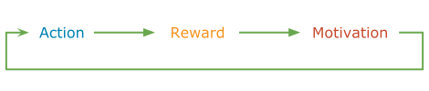

# What is Yay?

## The Idea
> Gamification can be applied to all technical and non-technical tasks during our daily working life.

> Everything can be gamified.

## The Implementation
Yay is an **gamification engine**, exposing a web service API, for integrating any kinds of gamification features into your organisation. Yay originally started as a 36 hours hackathon project at [trivago](https://github.com/trivago) to bring gamification features to our organisation. To integrate yay into many application landscapes it offers flexible extension points to write your own integrations.

## Yay Documentation
How-to-use, installation instructions, getting started guides, and extension documentation:

* [Read the documentation](docs/documentation.md)

## Installation

Yay is tested and packable to run through Docker on any operating system that supports Docker.

* [Installation instructions](docs/installation.md)
* [Releases on github.com](https://github.com/sveneisenschmidt/yay/releases)

## Get Yay Support and Help

**Reporting Issues**: To report an issue with Yay, please create an Issue here on github: https://github.com/sveneisenschmidt/yay/issues

## License

This project is released under the terms of the [Apache 2.0 license](http://www.apache.org/licenses/LICENSE-2.0).
