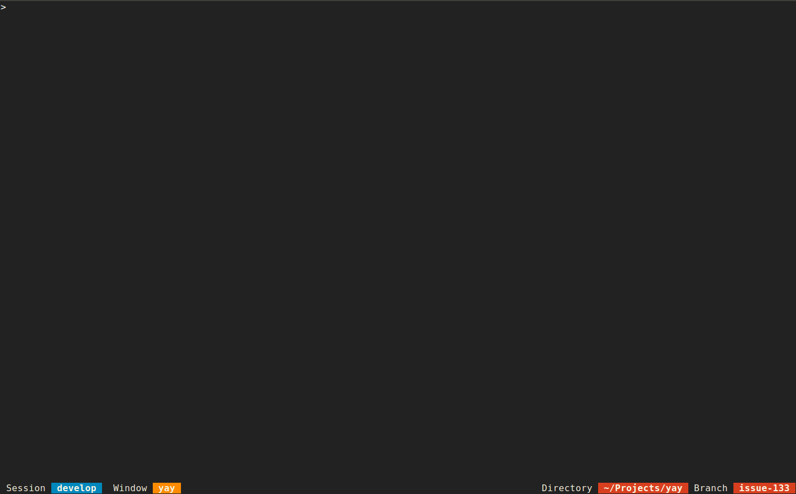

  
  <h3 align="center">Yay!</h3>
  
Gamification made simple.

  

    
    
    
     
    
    
    
    
  

  

    
  

---

Yay! is a **gamification engine** directly exposing a web service API to bring everyone the joy of gamification and integrating any kinds of gamified features into your organisation. The project originally started as a 36 hour hackathon project at [trivago](https://github.com/trivago). Yay's aim is to integrate into many different types of application landscapes by offering extension points that are flexible and easy to use with the ultimate goal being to write your own and tailored integration.

> Gamification can be applied to all technical and non-technical tasks during our daily working life. Everything can be gamified.

  

## Features
- Achievements
- Activity Stream
- Goals
- Leaderboards
- Notifications
- Player Scores & Levels
- [API](docs/examples.md#usage--api)
- [Webhooks](docs/under-the-hood.md#webhooks)

**Developer Highlights**
- Deploy and run it everywhere with [Docker](docs/getting-started.md#installation)
- Fast and easy to learn, runs on [PHP 7 & MySQL](docs/contributing.md#submit-a-pull-request)
- Easy to customise through a single [configuration format](docs/customisation.md#integration-with-third-parties)
- All functions are availabe through a [JSON-based API](docs/examples.md#usage--api)
- Support for third party systems like [GitHub](docs/under-the-hood.md#github) and [GitLab](docs/under-the-hood.md#gitlab) via [webhooks](docs/under-the-hood.md#webhooks)

## Documentation

Documentation can be found in the [docs folder](docs/README.md). Want to try it out or develop it further? Please see the [Contributing](docs/contributing.md) documentation. It provides everything to get you started. **Yay! Isn't that awesome?!**

---

Would you like to fix something in the documentation? Feel free to open an [issue](https://github.com/sveneisenschmidt/yay/issues).