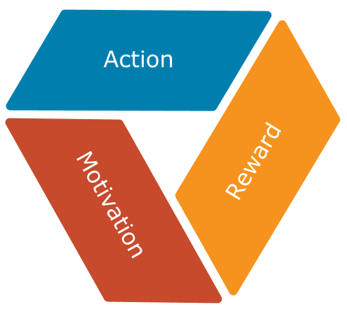

[](https://travis-ci.org/sveneisenschmidt/yay) [](https://codecov.io/gh/sveneisenschmidt/yay) [](https://styleci.io/repos/85753371) [](https://opensource.org/licenses/Apache-2.0)

#  What is Yay?

## The Idea
> Gamification can be applied to all technical and non-technical tasks during our daily working life. Everything can be gamified.



## The Implementation
Yay is a **gamification engine**, exposing a web service API, for integrating any kinds of gamification features into your organisation. Yay originally started as a 36 hours hackathon project at [trivago](https://github.com/trivago) to bring gamification features to our organisation. To integrate yay into many application landscapes it offers flexible extension points to write your own integrations.

## Yay Documentation
How-to-use demo, installation instructions, configuration examples and extension documentation:

* [Installation](docs/installation.md)
* [Configuration](docs/configuration.md)
* [API](docs/api.md)
* [Demo](docs/demo.md)
* [Custom Integrations](docs/integrations.md)
* [Development](docs/development.md)

## Installation
Yay is tested and packable to run through Docker on any operating system that supports Docker.

* [Installation](docs/installation.md)
* [Releases on github.com](https://github.com/sveneisenschmidt/yay/releases)

## Usage
```bash
curl -X "POST" http://localhost:50080/api/progress/ \
    -d "{\"player\":\"jane.doe\",\"action\":\"demo-action\"}"

[
    {
        "name": "demo-achievement-01",
        "label": "demo-achievement-01",
        "description": "demo-achievement-01",
        "points": 50,
        "achieved_at": "2017-10-08T13:22:08+0000",
        "links": {
            "self": "http://localhost:50080/api/players/jane.doe/personal-achievements/",
            "player": "http://localhost:50080/api/players/jane.doe/",
            "achievement": "http://localhost:50080/api/achievements/demo-achievement-01/"
        }
    }
]
```

Alternatively for easier integration into third-party systems a simple webhook api is available too:
```bash
curl -X "GET" http://localhost:50080/api/progress/?player=jane.doe&action=demo-action

[
    {
        "name": "demo-achievement-01",
        "label": "demo-achievement-01",
        "description": "demo-achievement-01",
        "points": 50,
        "achieved_at": "2017-10-08T13:22:08+0000",
        "links": {
            "self": "http://localhost:50080/api/players/jane.doe/personal-achievements/",
            "player": "http://localhost:50080/api/players/jane.doe/",
            "achievement": "http://localhost:50080/api/achievements/demo-achievement-01/"
        }
    }
]
```

Documentation on usage and demo examples:
* [API](docs/api.md)
* [Demo](docs/demo.md)

## Get Yay Support and Help

**Reporting Issues**: To report an issue with Yay, please create an Issue here on github: https://github.com/sveneisenschmidt/yay/issues


## License

This project is released under the terms of the [Apache 2.0 license](http://www.apache.org/licenses/LICENSE-2.0).
