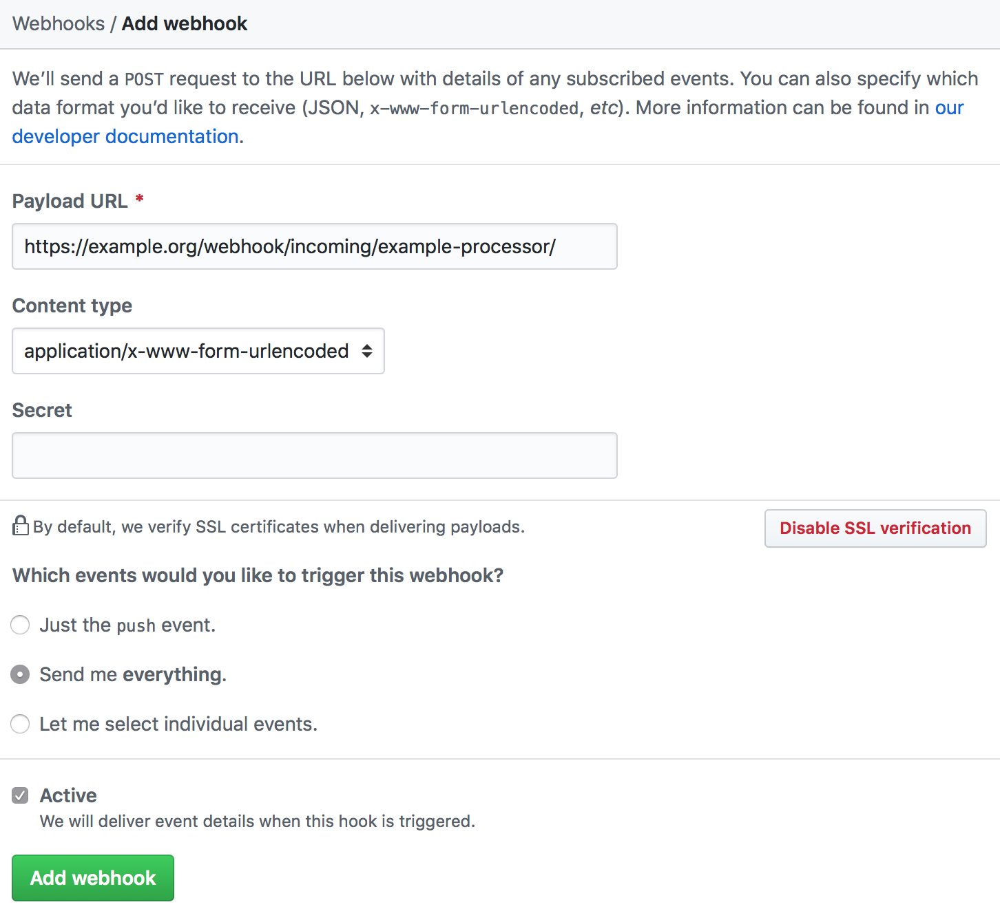

[Table of Contents](README.md) | [Getting Started](getting-started.md) | **Customisation** | [Examples](examples.md) | [Under The Hood](under-the-hood.md) | [Contributing](contributing.md)

---

# Customisation

* [Integration with Third-Parties](customisation.md#integration-with-third-parties)
* [Hosting](customisation.md#hosting)
* [Templates](customisation.md#templates)

---

## Integration with Third-Parties

Integrations are used to extend the application with new actions, achievements and validators. Before creating your own integration it is advised to have a look at the the [demo integration](../../integration/demo.yml) provided in the application's source.

In our example we will create a `mycompany` integration. To start please execute the following commands to create our integration setup file.

```bash
touch integration/mycompany.yml
```

### Integration setup

The integration setup file has a root element `integration` and four possible child nodes `actions`, `achievements`, and `validators`.

| Node | Description |
|---|---|
| actions | Actions a player can perform. |
| achievements | Achievements a player can earn. |
| validators | Validators verify a players actions against any achievement and grants if they pass all checks. ( `Validate::validate(Achievement, Actions): true||false` ) |
| webhooks | Processors that listen to incoming and outgoing webhooks to process payloads to push username and actions into the engine |

#### Example setup file
(See [demo integration](../integration/demo.yml))

```yml
integration:
    actions:
        example-action:
            label: Example action label
            description: Example actions description

    achievements:
        example-achievement-01:
            label: Example achievement label
            description: Example achievement description
            points: 50
            actions: ["example-action"]
        example-achievement-02:
            label: Example achievement label
            description: Example achievement description
            points: 100
            actions: ["example-action"]

    validators:
        # Grants achievement 'example-achievement-01' if action `example-action`
        # has been performed by the player 5 times.
        example-achievement-validator-01:
            type: expression
            arguments:
                - "achievement.getName() in ['example-achievement-01'] and actions.count() >= 5"
        # Grants achievement 'example-achievement-01' if action `example-action`
        # has been performed by the player 10 times.
        example-achievement-validator-02:
            type: expression
            arguments:
                - "achievement.getName() in ['example-achievement-02'] and actions.count() >= 10"

    webhooks:
        incoming_processors:
            # Chains multiple processors
            example:
                type: chain
                arguments:
                    - [example-defaults, example-action, example-user]
            # Set defaults
            example-defaults:
                type: dummy
                arguments:
                    -
                        username: jane.doe
                        action: demo.action
            # Maps third party action to application action
            example-action:
                type: static-map
                arguments:
                    - action
                    -
                        third_party.demo_action: example-action-02
            # Maps third party username to application username
            example-user:
                type: static-map
                arguments:
                    - username
                    -
                        third_party.example_user: jane.doe


```

### Structure

#### `actions`

Actions are declared as multi-dimensional associative arrays. Keys on the first level are the actions name, keys and values on second level are the properties of the action. Internally actions are of type [ActionDefinition](../src/Component/Entity/Achievement/ActionDefinition.php) and need to be imported to the database during installation.

Supported properties: `label`, `description`.

```yml
integration:
    # ...
    actions:
        # First level
        example-action-01:
            # Second level
            label: Example action label
            description: Example actions description"
        # First level
        example-action-02:
            # Second level
            label: Example action label
            description: Example actions description"
    # ...
```

#### `achievements`

Achievements are declared as multi-dimensional associative arrays. Keys on the first level are the achievements name, keys and values on second level are the properties of the achievement. The `actions` property takes a list of actions defined under `actions` or in a different integration, so they can get referenced while validation. Internally achievements are of type [AchievementDefinition](..src/Component/Entity/Achievement/AchievementDefinition.php) and need to be imported to the database during installation.

Supported properties: `label`, `description`, `points`, `actions`.

```yml
integration:
    # ...
    achievements:
        # First level
        example-achievement-01:
            # Second level
            label: Demo example label
            description: Demo example description
            points: 50
            actions: ["example-action"]
        # First level
        example-achievement-02:
            # Second level
            label: Demo example label
            description: Demo example description
            points: 100
            actions: ["example-action"]
    # ...
```

#### `validators`

Validators are declared as multi-dimensional associative arrays. Keys on the first level are the validators name, keys and values on second level are the properties of the validator. During runtime the application needs to know when to grant an achievement after a certain set of actions have been performed by a player. To provide this functionality the application uses validators that are able to tell if achievement criteria have been met. Internally validators implement the [AchievementValidatorInterface](../src/Component/Engine/AchievementValidatorInterface.php), a default validator that uses the [Expression Language](https://symfony.com/doc/current/components/expression_language.html) component is provided and simplifies the evaluation of achievements.

Supported properties: `type`, `arguments`, `class`. If you provide `expression` for `type` internally the property `class` gets set to `ExpressionLanguageValidator`.

```yml
integration:
    # ...
    validators:
        # First level
        # Grants achievement 'example-achievement-01' if action `example-action`
        # has been performed by the player 5 times.
        example-achievement-validator-01:
            # Second level
            type: expression
            arguments:
                - "achievement.getName() in ['example-achievement-01'] and actions.count() >= 5"
        # Grants achievement 'example-achievement-01' if action `example-action`
        # has been performed by the player 10 times.
        # First level
        example-achievement-validator-02:
            # Second level
            type: expression
            arguments:
                - "achievement.getName() in ['example-achievement-02'] and actions.count() >= 10"
    # ...
```

#### `webhooks`.`incoming`

Webhook are declared as multi-dimensional associative arrays. Keys on the first level are the processor name, keys and values on second level are the properties of the webhook. During runtime the application needs to identify a processor by  its through a route parameter. Internally, processors implement the `ProcessorInterface`([1](../src/Component/Webhook/Incoming/ProcessorInterface.php), [2](../src/Component/Webhook/Outgoing/ProcessorInterface.php)) for incoming and outgoing webhooks.

Supported properties: `type`, `arguments`, `class`. If you provide `chain` for `type` the property `class` gets set to `ChainProcessor`, if you provide `dummy` it is set to `DummyProcessor` and if you provide `null` it is set to `NullProcessor` internally.

```yml
integration:
    # ...
    webhooks:
        incoming_processors:
            # Chains multiple processors into one
            example-chain:
                type: chain
                arguments:
                    - [example-mycompany-jenkinsci, example-mycompany-users]
            # Your company provides a processor to transform Jenkins CI payloads
            example-mycompany-jenkinsci:
                class: MyCompany\Component\Webhook\Incoming\Processor\JenkinsProcessor
            # Your company provides a second processor to map jenkins users to Yay players
            # based on a static configuration file deployed with the application
            example-mycompany-jenkinsci:
                class: MyCompany\Component\Webhook\Incoming\Processor\StaticUserProcessor
                arguments: [ '%kernel.root_dir/../integration/mycompany/users.yml%' ]
    # ...
```

### Using your integration

#### 1) Validate your integration
```bash
$ make shell
$ php bin/console yay:integration:validate mycompany integration/mycompany

[OK] Integration "mycompany" valid
```

#### 2) Enable your integration
```bash
$ make shell
$ php bin/console yay:integration:enable mycompany integration/mycompany

[OK] Integration "mycompany" enabled
```

#### 3) Disable your integration
```bash
$ make shell
$ php bin/console yay:integration:disable mycompany

[OK] Integration "mycompany" disabled
```
Hint: The disable routine will only remove the configuration. Entities created during the installation will not be removed due to the fact that they often share relations to other entities (e.g. players and their personal achievements.)

---

## Hosting

To leverage the full potential of Yay it is encouraged to run it trough Docker. A easy way to do so is to use a platform like [sloppy.io](https://sloppy.io). We created a set of recipes to get you started, you can find them on [sveneisenschmidt/yay-recipes-sloppy](https://github.com/sveneisenschmidt/yay-recipes-sloppy).

--

## Templates
Yay sends a set of emails when events occur. It is powered by [Lee Munroe's](https://github.com/leemunroe) amazing [email templates](https://github.com/leemunroe/responsive-html-email-template).

It is possible to override the layout ([`templates/Mail/layout.html.twig`](../templates/Mail/layout.html.twig).) or any other template for your liking.

The following emails are sent:

### New Player joined Yay!
```
Yay!

You've been awarded a new achievement:

1x Code-aholic - Perform five times an action on any pull request. Can be awarded multiple times.

Have a nice day and keep on rockin'!
```
You can find the template in [`templates/Mail/create_player.html.twig`](../templates/Mail/create_player.html.twig). Sending is triggered by the [`yay.engine.create_player`](../src/App/Mail/EventListener/MailListener.php) event.

### New personal action recorded
```
Yay!

A new action has been recorded for you:

1x Pull request opened - ...

Have a nice day and keep on rockin'!
```
You can find the template in [`templates/Mail/grant_personal_achievement.html.twig`](../templates/Mail/grant_personal_achievement.html.twig). Sending is triggered by the [`yay.engine.grant_personal_achievement`](../src/App/Mail/EventListener/MailListener.php) event.

### New personal achievement awarded
```
Yay!

You've been awarded a new achievement:

1x Code-aholic - Perform five times an action on any pull request. Can be awarded multiple times.

Have a nice day and keep on rockin'!
```
You can find the template in [`templates/Mail/grant_personal_action.html.twig`](../templates/Mail/grant_personal_action.html.twig). Sending is triggered by the [`yay.engine.grant_personal_action`](../src/App/Mail/EventListener/MailListener.php) event.

integration:
    webhooks:
        incoming_processors:
            example-static-map:
                type: static-map
                arguments:
                    - username
                    -
                        # username=octocate => username=jane.doe
                        octocat: jane.doe
```
URL:  `/webhook/incoming/example-static-map/`.

### Third party incoming processors

#### `GitHub`

The [GithubProcessor](../src/ThirdParty/Github/Webhook/Incoming/Processor/GithubProcessor.php) processes GitHub webhook payloads to extract `username` and `actions`.

```yml
integration:
    webhooks:
        incoming_processors:
            example-github:
                type: class
                class: Yay\ThirdParty\Github\Webhook\Incoming\Processor\GithubProcessor
```
URL:  `/webhook/incoming/example-github/`.

### Example GitHub

Famous git platform GitHub use the concept of webhooks [(official documentation)](https://developer.github.com/webhooks/) to connect their own and third party systems in a simple way. With this in mind it is possible to connect GitHub and Yay very easily, the only needed part is a custom processor that is able to interpret the payload sent by GitHub, process and transform it so Yay is able to process it as well.

#### Configuration in Yay

```yml
integration:
    webhooks:
        incoming_processors:
            example-processor:
                type: chain
                arguments:
                    - [ example-github ]
            example-github:
                type: class
                class: Yay\ThirdParty\Github\Webhook\Incoming\Processor\GithubProcessor
            example-users:
                type: static-map
                arguments:
                    - username
                    -
                        octocat: jane.doe
```
URL:  `/webhook/incoming/example-processor/`.

#### Configuration in Github


